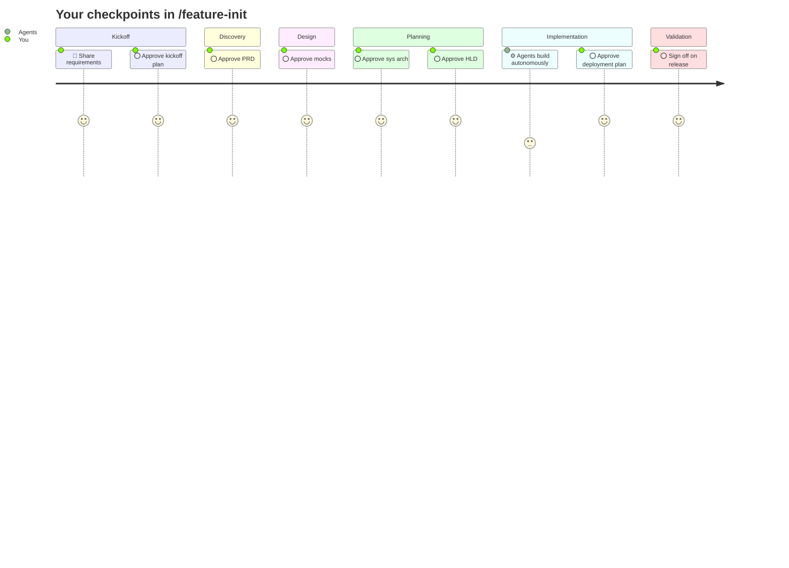

# Claude Code Agents

Give your Claude Code project a full engineering team, not just a single AI assistant.

---

Most AI coding tools work in isolation: one model, one task, one answer. Real software delivery doesn't work that way. It takes product thinking, design, architecture, backend, frontend, QA, and someone to coordinate all of it.

This framework gives you all of that, pre-wired and ready to go.

---

## A full team, under your direction

You get a complete senior engineering team: Product Manager, UX/UI Designer, Software Architect, Engineering Manager, Backend Engineer, Frontend Engineer, Swift Engineer, DevOps Engineer, QA Engineer, and macOS Designer.

They collaborate the way a real team does. At every pivotal moment (PRD, mocks, architecture, implementation plan, deployment, release) the team stops and waits for your input before proceeding. **Nothing happens without your approval.** Between checkpoints, agents work autonomously and track their progress so you can pick up exactly where you left off.

---

## Get started in two steps

**1. Install**

From your project root:

```bash
bash <(curl -fsSL https://raw.githubusercontent.com/sans-github/agentic-delivery-framework/main/install.sh)
```

To pin a specific version:

```bash
bash <(curl -fsSL https://raw.githubusercontent.com/sans-github/agentic-delivery-framework/main/install.sh) v1.2.0
```

This does the following:

- Copies agents, rules, skills, and templates into `.claude/`
- Copies this README into `.claude/agents-guide.md`
- Creates or updates `CLAUDE.md` with `@.claude/my-project-config.md` — this import is what makes Claude Code load your stack config automatically. `my-project-config.md` imports `framework-config.md`, so agents get artifact paths, naming conventions, and tooling choices transitively. Without this import, agents cannot locate where to write anything.

Commit the result to lock the version.

**2. Run your first feature**

```
/feature-init
```

Claude walks you through setup, gathers requirements, scaffolds the feature folder, and kicks off the full workflow. You approve at every major decision point. Nothing proceeds without you.

Here is what to expect:

After release sign-off, three wrap-up stages run automatically: master baseline update (PM and Designer consolidate into `projects/master/`), documentation refresh (README, CLAUDE.md, and `scripts/dev.sh`), and release sign-off. None are skippable.



---

## Not sure yet?

Run the dry run first:

```
/feature-init-dry-run
```

Every agent writes placeholder output instead of real artifacts. All gates, commits, and progress steps fire for real. You see exactly how it works before committing to a real feature.

---

## How it works

[Read the full guide](docs/how-it-works.md)

---

## Phases and artifact ownership

Agents collaborate by exchanging artifacts. The Gatekeeper is the role with final say: they review, raise concerns, and resolve with the owner before downstream work proceeds.

<details>
<summary>Show phase tables</summary>

### Discovery
| Artifact | Owner | Key collaborators | Gatekeeper |
|---|---|---|---|
| Reqs | User | PM gathers | |
| PRD, ACs | PM | EM reviews | PM |
| Mocks | Designer | PM refines jointly | PM |

### System Design
| Artifact | Owner | Key collaborators | Gatekeeper |
|---|---|---|---|
| Sys Arch | Arch | EM drives, Arch authors | Arch |
| Eng Plans (HLD) | EM | Arch contributes, FE + BE align | EM |

### Engineering Design
| Artifact | Owner | Key collaborators | Gatekeeper |
|---|---|---|---|
| BE Detailed Design | BE | EM monitors; intercepts and collaborates to resolve on red flag | EM |
| FE Detailed Design | FE | EM monitors; intercepts and collaborates to resolve on red flag | EM |
| API Contract | FE + BE | EM monitors; intercepts and collaborates to resolve on red flag | EM |

### Implementation Planning
| Artifact | Owner | Key collaborators | Gatekeeper |
|---|---|---|---|
| Test Plan | QA | EM monitors; intercepts and collaborates to resolve on red flag | EM |
| Issues List | BE / FE / QA | EM signs off each list | EM |

### Implementation
| Artifact | Owner | Key collaborators | Gatekeeper |
|---|---|---|---|
| CI/CD Pipeline + IaC | DevOps | EM monitors; intercepts and collaborates to resolve on red flag | EM |
| Deployment Smoke Check | QA | DevOps hands off live URL; QA runs checks; failures loop back to DevOps | EM |
| BE Artifacts | BE | QA tests, Arch reviews, EM monitors | EM |
| FE Artifacts | FE | QA tests, EM monitors | EM |
| BE Test Docs | BE | QA consumes | EM |
| FE Test Docs | FE | QA consumes | EM |

### Validation
| Artifact | Owner | Key collaborators | Gatekeeper |
|---|---|---|---|
| Automation | QA | EM monitors; intercepts and collaborates to resolve on red flag | EM |

</details>

---

## See also

- [Contributing](CONTRIBUTING.md)
